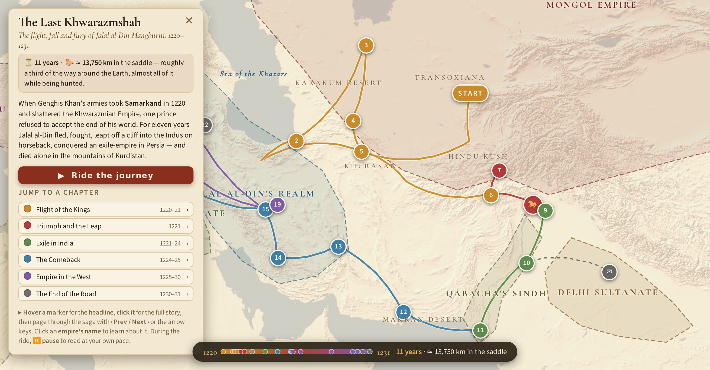

# The Last Khwarazmshah — an interactive story map

The extraordinary journey of **Jalal al-Din Mangburni**, the last Khwarazmshah:
eleven years and roughly **13,750 km** in the saddle, from the fall of Samarkand
in 1220 to a lonely death in the mountains of Kurdistan in 1231 — with the
Mongol Empire hunting him most of the way.

## Features

- 🗺️ The world of the **1220s** (approximate borders and period names) with a
  one-click toggle to today's map for orientation
- 📍 25 story events — hover for the headline, click for the full tale, page
  through with *Prev / Next* or the arrow keys
- 🐎 **Ride the journey**: an animated playback with a live year ticker and
  distance odometer
- 📊 A clickable 1220–1231 timeline showing how much happened in how little time
- 📱 Works on desktop and mobile; nothing to install

## Run it

Open `index.html` in any browser — it is a single self-contained page
(an internet connection is needed for the map tiles).

## Feedback

Spotted a historical error, or have an idea? Please
[open an issue](../../issues) — feedback is very welcome.

## Credits & license

Created by **[YingzhiVA](https://github.com/YingzhiVA)**. Built by
**Claude (Fable 5)**, Anthropic's AI, using the open-source
[Leaflet](https://leafletjs.com) library. Basemaps © Esri and contributors.
Chief historical sources: al-Nasawi's biography of Jalal al-Din and Juvayni's
*History of the World-Conqueror*. Borders, routes and distances are approximate
reconstructions for storytelling.

Licensed under [CC BY 4.0](LICENSE) — share, adapt and reuse freely, as long
as you credit **YingzhiVA** as the original creator.
